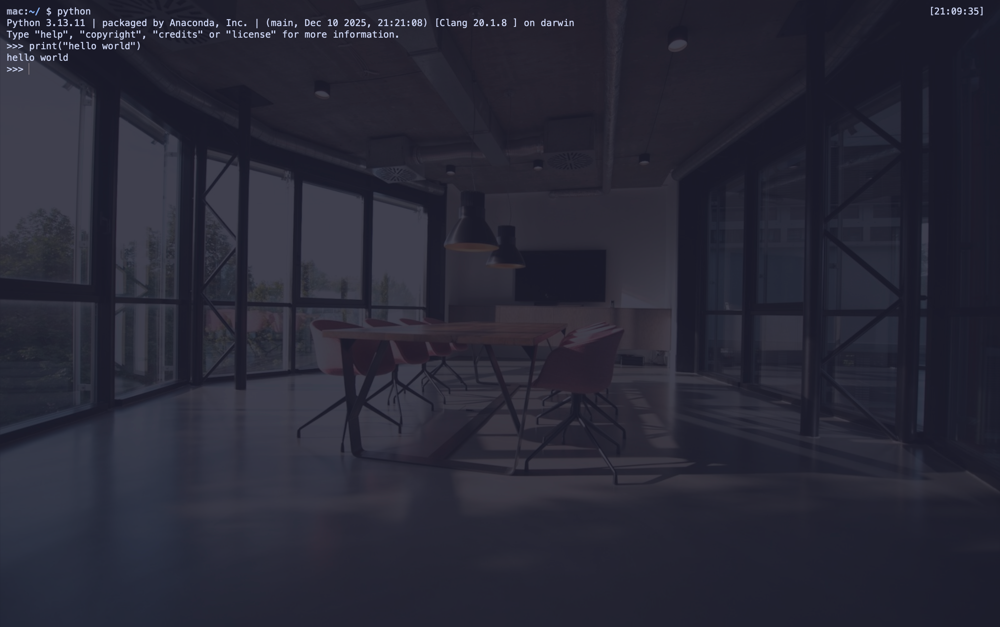
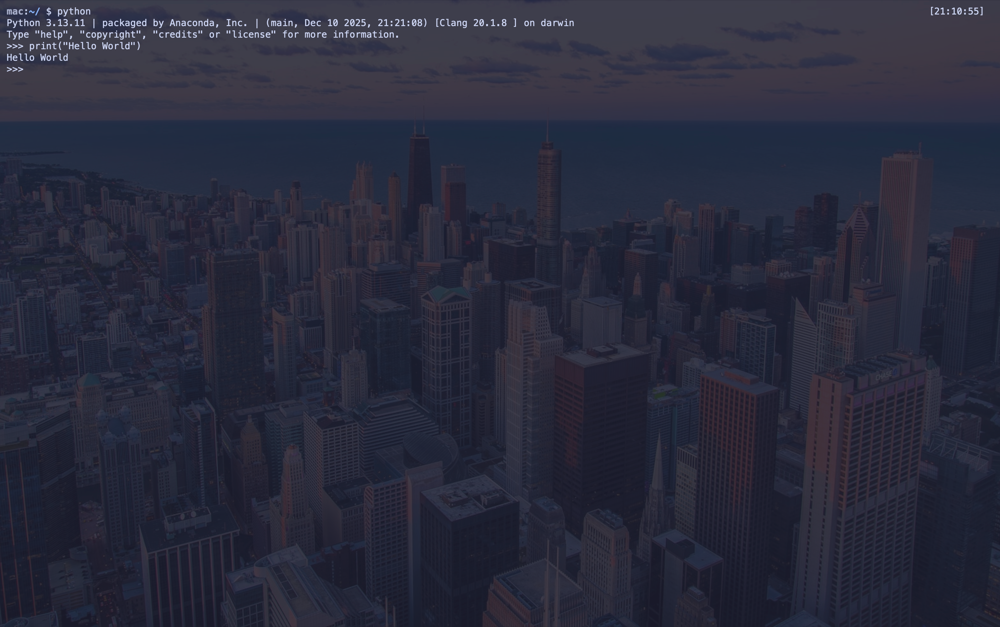
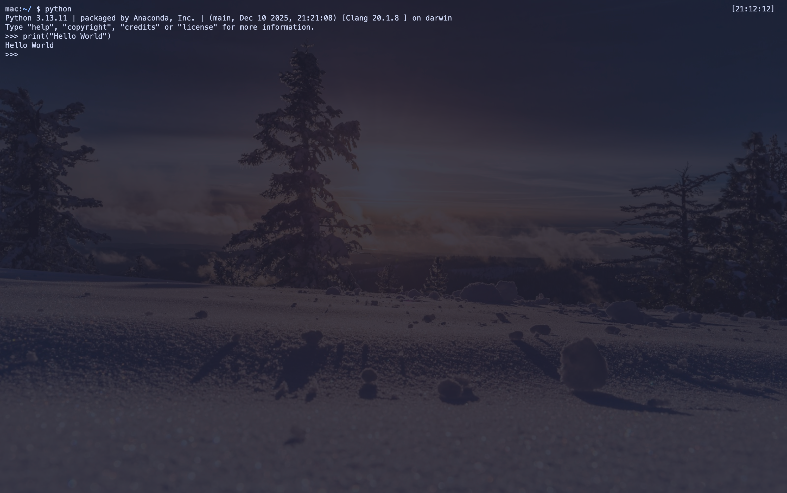

<div align="center">

# Ghostty Ambient

### 让你的终端，随时间、天气和心情改变背景

一个 macOS 优先的本地工具，为 [Ghostty](https://ghostty.org/) 自动选择并切换背景图片。它不改变终端输出，不引入常驻 GUI，只用一个轻量 CLI 让每次打开 shell 都拥有合适的氛围。

<p>
  <a href="https://github.com/RiverYanggg/ambient-coding">GitHub</a> ·
  <a href="docs/CONFIGURATION.md">完整配置</a> ·
  <a href="chezmoi/dot_config/ghostty/backgrounds/SOURCES.md">图片来源</a>
</p>

</div>

<p align="center">
  
  
  
</p>

## Why Ghostty Ambient?

终端是每天工作的入口，也可以拥有一点与当前状态匹配的空间感：

- 早晨、下午、夜晚使用不同背景
- 根据天气自动选择晴、阴、雨、雪或雷暴素材
- 用 `calm`、`focus`、`energy`、`tired`、`happy` 表达当前心情
- 随机选择素材，同时避免连续两次重复
- 图片与配置优先保存在本地，网络失败也不影响已有素材
- 可以替换图片、指定自己的素材库，或扩展新的模式

## Modes at a glance

| 模式 | 用法 | 适合场景 |
| --- | --- | --- |
| Time | `--mode time` | 按一天中的时段自动切换 |
| Weather | `--mode weather --weather auto` | 根据当前位置天气切换 |
| Mood | `--mode mood --mood focus` | 手动选择工作氛围 |
| Random | `--mode random` | 从全部素材中随机选择 |

## Quick start

### Requirements

- macOS
- [Ghostty](https://ghostty.org/) 1.2.0 或更高版本
- Bash、zsh、curl
- `jq`（仅自动天气模式需要）
- Homebrew（推荐，安装脚本可自动处理依赖）

### Install

```bash
git clone https://github.com/RiverYanggg/ambient-coding.git
cd ambient-coding
bash scripts/install-ambient.sh
source ~/.zshrc
```

安装脚本会将图片复制到 `~/.config/ghostty/backgrounds/`，安装 `ghostty-time-background`，只更新 Ghostty 配置中的 `background-image`，并添加幂等的 zsh 启动钩子。它不会覆盖其他 Ghostty 设置。

不希望脚本安装依赖时：

```bash
bash scripts/install-ambient.sh --no-deps
```

## Try it now

```bash
# 按时间选择
ghostty-time-background --mode time --time 09:00
ghostty-time-background --mode time --time 13:00
ghostty-time-background --mode time --time 19:00

# 按天气选择
ghostty-time-background --mode weather --weather rain
ghostty-time-background --mode weather --weather auto

# 按心情或随机选择
ghostty-time-background --mode mood --mood focus
ghostty-time-background --mode random
```

为新打开的 Ghostty 窗口保存默认模式：

```bash
ghostty-time-background --set-mode weather --weather auto
ghostty-time-background --set-mode mood --mood calm
ghostty-time-background --set-mode random

# 恢复默认的时间模式
ghostty-time-background --set-mode time
```

当前窗口没有刷新时，按 Ghostty 的配置重载快捷键 `Cmd + Shift + ,`。脚本也会尝试自动触发；macOS 可能要求在“系统设置 -> 隐私与安全性 -> 辅助功能”中允许终端应用控制 Ghostty。测试时可以加上 `--no-reload`。

## Weather without an API key

自动天气模式使用公开的 Open-Meteo 接口，不需要 API Key：

```text
IP location -> Open-Meteo -> weather code -> local image
```

如果不希望使用 IP 定位，可以指定经纬度：

```bash
export GHOSTTY_LATITUDE=31.2304
export GHOSTTY_LONGITUDE=121.4737
ghostty-time-background --mode weather --weather auto
```

当前实现不直接读取 macOS Weather App。Open-Meteo 免费接口适用于非商业使用；商业产品请使用合适的商业方案，并遵守服务条款与 CC BY 4.0 要求。

## Customize

默认素材按模式组织：

```text
backgrounds/
├── morning/ afternoon/ evening/     # time
├── clear/ cloudy/ rain/ snow/ storm/ # weather
└── calm/ focus/ energy/ tired/ happy/ # mood
```

替换图片或使用自己的素材库：

```bash
cp ~/Pictures/my-focus-image.jpg ~/.config/ghostty/backgrounds/focus/
ghostty-time-background --mode mood --mood focus

export GHOSTTY_BACKGROUND_DIR="$HOME/Pictures/ghostty-backgrounds"
ghostty-time-background --mode random
```

支持 `.jpg`、`.jpeg` 和 `.png`。建议使用宽度约 1600-1920px 的压缩图片，降低每个终端实例的显存占用。自定义目录的结构与仓库中的 `backgrounds/` 相同。

## For agents

仓库包含 `AGENTS.md` 和 `skills/ghostty-ambient-background/SKILL.md`，可以让 Codex 或 Claude Code 按项目规则完成配置：检查依赖、查看 chezmoi diff、选择模式、配置天气经纬度，并执行校验和模式测试。

```text
请阅读 AGENTS.md，并根据我的偏好配置 Ghostty Ambient。
我希望默认使用天气模式，心情模式支持 calm、focus、deep-work。
```

## Project map

| 路径 | 作用 |
| --- | --- |
| `scripts/install-ambient.sh` | 独立安装器 |
| `chezmoi/dot_local/bin/executable_ghostty-time-background` | 核心 CLI |
| `chezmoi/dot_config/ghostty/config.tmpl` | Ghostty 配置模板 |
| `chezmoi/dot_config/ghostty/backgrounds/` | 默认图片与分类目录 |
| `docs/CONFIGURATION.md` | 完整终端配置指南 |
| `AGENTS.md` | Agent 自动化规则 |

本仓库也保留完整的 macOS 终端工作区配置。需要 Yazi、lazygit、fastfetch 等全部工具时，可以查看 `scripts/bootstrap.sh`；只想使用动态背景功能，请使用 `scripts/install-ambient.sh`。

## License and image rights

代码使用 MIT License。默认图片仅作为原型素材，来源和下载地址记录在 [SOURCES.md](chezmoi/dot_config/ghostty/backgrounds/SOURCES.md)。发布商业产品前，请逐张确认图片授权与 attribution 要求，或替换为拥有明确再分发权的素材。
